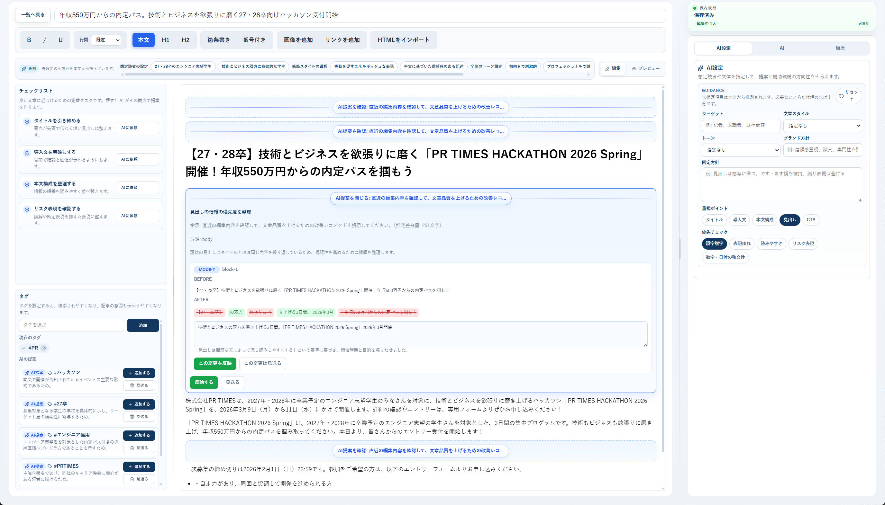

# Team Avengers

Hackathon 2026 Spring 向けに開発された、プレスリリース作成支援アプリです。

このプロダクトは、PR TIMES が開催した「PR TIMES HACKATHON 2026 Spring」で制作したものです。

- チーム賞を受賞: バックグラウンドで動く AI agent を組み込んだ構成と、UI/UX の完成度が評価されました
- [@Keyhole-Koro](https://github.com/Keyhole-Koro) が個人賞を受賞: トップレベルのアイデアと実装力と評されました

ハッカソン概要:

- [年収550万円以上で即内定！技術×ビジネス思考を磨く27・28卒向けハッカソン受付開始 | 株式会社PR TIMES](https://prtimes.jp/main/html/rd/p/000001614.000000112.html)

## このプロジェクトの特徴

- ターゲット、文章スタイル、トーン、ブランド方針、固定方針、重視ポイント、優先チェック項目を設定でき、LLM の提案内容をプレスリリースの目的に合わせてパーソナライズできます。単に「改善して」と依頼するのではなく、誰にどう読ませたいかを事前に指定したうえで編集を任せられます。
- AI agent はバックグラウンドで動作し、本文の推敲だけでなく、未設定のターゲットや文章スタイルなども本文から推測して自動提案します。設定は補助候補として提示され、必要なものだけを取り込めます。
- AI は単なるチャット欄に閉じず、設定候補をボタンやリストで提示し、本文への修正提案もエディタ上で直接確認できる形で表示します。提案内容をその場で反映・見送りできるため、機能が隠れず、普段の編集フローに自然になじむ UI になっています。

## アプリ画面



## 主な機能

- プレスリリースの作成・保存・一覧表示
- リビジョン履歴の取得と復元
- コメントスレッドの作成、返信、解決
- AI による文章編集、タグ提案、設定提案
- WebSocket を使った共同編集向けのリアルタイム連携

## 技術スタック

| レイヤー | 実装 |
| --- | --- |
| フロントエンド | React 19 + Vite + TypeScript |
| バックエンドAPI | Node.js + TypeScript + Hono |
| AI エージェント | Python + Flask |
| データベース | PostgreSQL 16 |

## クイックスタート

### 1. 環境変数を用意

```bash
cd webapp
cp .env.example .env
```

### 2. バックエンド群を起動

```bash
cd webapp
docker compose up -d --build
```

起動後、以下で疎通確認できます。

```bash
curl http://localhost:8080/health
curl http://localhost:5001/health
```

### 3. フロントエンドを起動

```bash
cd webapp/frontend/react
npm install
npm run dev
```

通常は `http://localhost:5173` で確認できます。

## ディレクトリ構成

```text
.
├── README.md
├── webapp/
│   ├── README.md
│   ├── docker-compose.yml
│   ├── agent/           # Flask 製 AI エージェント
│   ├── node/            # Hono 製 API サーバー
│   ├── frontend/react/  # React + Vite フロントエンド
│   ├── sql/             # DB 初期化 SQL
│   └── docs/            # 補足ドキュメント
└── .github/
```

## ドキュメント

- [webapp/README.md](./webapp/README.md): バックエンドと AI エージェントの起動方法、API 概要
- [webapp/docs/db-schema-and-flow.md](./webapp/docs/db-schema-and-flow.md): DB スキーマと保存フロー
- [webapp/docs/agent-overview.md](./webapp/docs/agent-overview.md): AI エージェント構成
