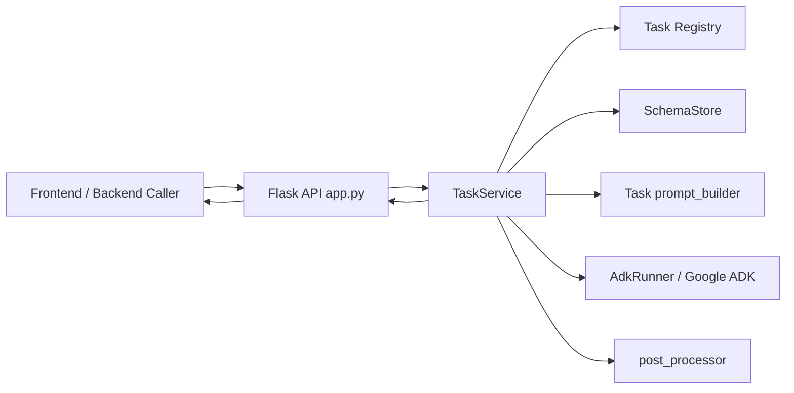
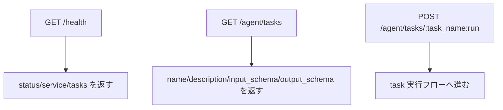
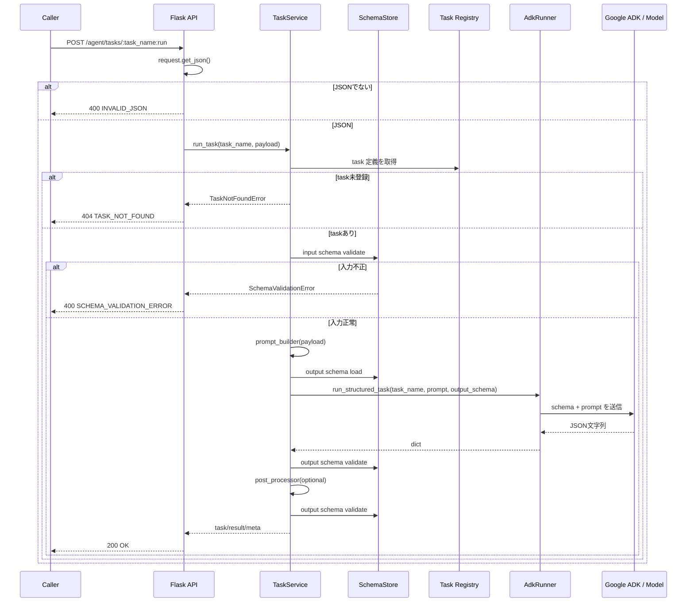
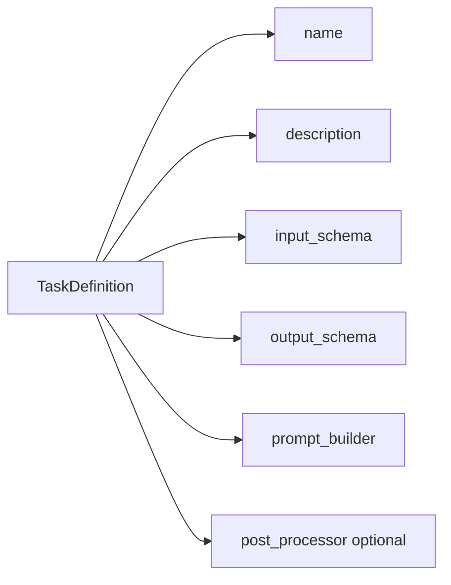
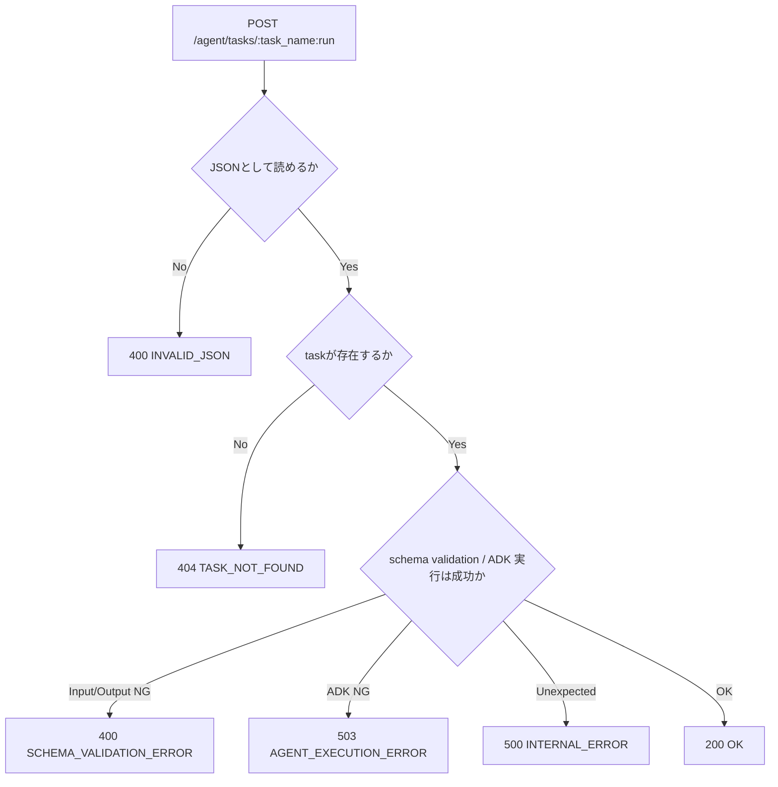

# AI Agent アーキテクチャ概要

このドキュメントは、`webapp/agent` 配下の AI agent がどういう責務で動いているかを、API と内部レイヤの観点でまとめたものです。

## 1. AI Agent の全体像

現在の AI agent は Flask ベースの JSON API です。
役割は「自由文チャット」ではなく、「入力 JSON を受けて、JSON Schema に合う構造化結果を返すバックエンド task 実行器」です。

構成要素は大きく次の 5 層です。

- `app.py`: HTTP ルーティングとエラーハンドリング
- `registry.py`: 利用可能な task 定義の登録
- `services/task_service.py`: task 実行のオーケストレーション
- `services/validator.py`: 入出力 JSON Schema の検証
- `services/adk_runner.py`: Google ADK を使った LLM 実行

### 図: レイヤ構成



## 2. 公開 API

現在の agent が提供している HTTP エンドポイントは次の 3 つです。

- `GET /health`: サービス疎通確認。登録済み task 名も返す
- `GET /agent/tasks`: 実行可能な task 一覧を返す
- `POST /agent/tasks/<task_name>:run`: 指定 task を実行する

### 図: API エントリポイント



## 3. 共通 task 実行フロー

`POST /agent/tasks/<task_name>:run` で受けた処理は、ほぼすべて `TaskService.run_task()` に集約されています。
task ごとに API を増やすのではなく、task 定義をレジストリから引いて共通パイプラインで処理します。

### ステップ一覧

1. Flask が request body を JSON として読む
2. JSON でなければ `INVALID_JSON` を返す
3. `TaskService` が task 名をレジストリから検索する
4. 未登録なら `TASK_NOT_FOUND` を返す
5. 入力 payload を input schema で検証する
6. task ごとの `prompt_builder` で LLM 用 prompt を作る
7. output schema を ADK 実行時にも渡す
8. ADK から返った JSON を output schema で再検証する
9. task に `post_processor` があれば後処理する
10. 後処理後の結果を再度 schema 検証する
11. `task`, `result`, `meta` を含む JSON レスポンスを返す

### 図: 共通 task 実行シーケンス



## 4. task registry の役割

task の追加は、個別 if 文を増やす方式ではなく、`TaskDefinition` をレジストリに積む方式です。
現在登録されている task は次の 2 つです。

- `document_edit`
- `checklist_generate`

task 定義には以下が含まれます。

- `name`
- `description`
- `input_schema`
- `output_schema`
- `prompt_builder`
- `post_processor`

### 図: task 登録モデル



## 5. SchemaStore の責務

この agent の重要な特徴は、LLM の前後で必ず schema validation を行う点です。

- schema は `webapp/agent/schemas/*.json` に置く
- `SchemaStore.load()` が schema JSON を読み込み、メモリキャッシュする
- `SchemaStore.validate()` が `Draft202012Validator` で検証する
- エラー時は `SchemaValidationError` を投げ、パス付きの `details` を返せる

つまり、入出力ともに contract-first で扱う設計です。

## 6. AdkRunner の責務

`AdkRunner` は Google ADK を使って、各 task を「JSON を返す 1 回の structured generation」として実行します。

### 実行前提

- `google-adk` がインストール済みであること
- `GOOGLE_API_KEY` が設定されていること
- `AGENT_MODEL` 未設定時は `gemini-3-flash`
- `AGENT_APP_NAME` 未設定時は `press-release-agent`

### 実行内容

1. 共通 instruction を固定で与える
2. task ごとの prompt と output schema を 1 メッセージにまとめる
3. `InMemoryRunner` で ADK セッションを作る
4. `run_async()` のイベントを最後まで読む
5. 最後に得た text を JSON parse する

### 図: ADK 呼び出しの内部フロー

```mermaid
flowchart TD
  A[TaskService] --> B[AdkRunner.run_structured_task]
  B --> C[google.adk.Agent を生成]
  C --> D[InMemoryRunner を生成]
  D --> E[session を作成]
  E --> F[output schema + task prompt を1メッセージ化]
  F --> G[runner.run_async]
  G --> H[event.content.parts[].text を走査]
  H --> I[最後の text を採用]
  I --> J[json.loads]
  J --> K[dict を TaskService に返す]
```

### 注意点

- 複数イベントが来ても、保持するのは最後に見つかった text
- 空レスポンスなら `ADK returned an empty response.`
- JSON parse 失敗なら `ADK response was not valid JSON.`

## 7. エラーハンドリング

HTTP レイヤでの主な失敗系は次の通りです。

| ケース | HTTP | code | 内容 |
|---|---:|---|---|
| body が JSON でない | 400 | `INVALID_JSON` | `request.get_json()` が失敗 |
| task 未登録 | 404 | `TASK_NOT_FOUND` | レジストリに task が無い |
| input/output schema 不一致 | 400 | `SCHEMA_VALIDATION_ERROR` | `details` に path と message を返す |
| ADK 実行失敗 | 503 | `AGENT_EXECUTION_ERROR` | 依存不足、API key 未設定、空応答、JSON 解析失敗など |
| 想定外例外 | 500 | `INTERNAL_ERROR` | サーバ内部エラー |

### 図: エラー分岐



## 8. DB との関係

現時点の `webapp/agent` 実装自体は、DB に直接アクセスしていません。
AI agent の責務は次に限定されています。

- 入力 JSON を受ける
- 構造化された編集提案またはチェックリストを生成する
- schema に沿ったレスポンスを返す

永続化は別 API / 別レイヤで担う前提です。

`document_edit` では提案本体に加えて、チャット欄に出す短い案内文と、提案位置へ移動するための短いボタン文言も agent が返します。

## 9. フロント設定との連携

現在の `document_edit` は、単なる自然文 prompt だけでなく、フロントで設定した編集方針も受け取れます。

- 想定読者
- 文章スタイル
- トーン
- ブランド方針
- 重視ポイント
- 優先チェック項目

これらは Node API で `instructions` に変換され、最終的に agent prompt に埋め込まれます。
そのため、同じ「改善して」という依頼でも、設定によって提案内容を変えられる構成です。
