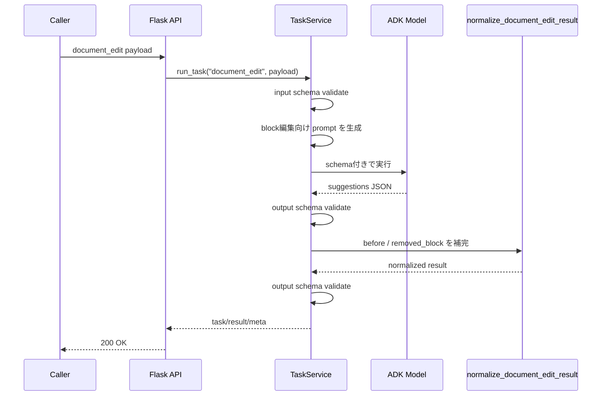
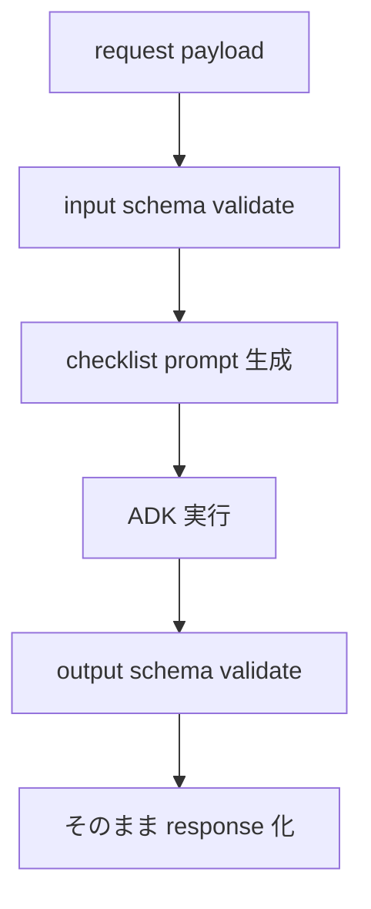

# AI Agent の task 別フロー

このドキュメントは、現在登録されている task ごとの入出力と処理差分をまとめたものです。

## 1. 対象 task

現在登録されている task は次の 2 つです。

- `document_edit`
- `checklist_generate`

## 2. `document_edit`

`document_edit` は TipTap ライクな block 配列に対して、完成本文ではなく「編集提案」を返す task です。

### 入力

- `context.reference_docs[]`: 参照文書
- `context.uploaded_materials[]`: アップロード資料
- `document.title`
- `document.blocks[]`: block 単位の本文
- `instructions.goal`
- `instructions.tone`
- `instructions.must_include[]`
- `instructions.must_avoid[]`
- `instructions.language`

`document.blocks` は最低 1 件必要です。
block の `type` は次に限定されています。

- `heading`
- `paragraph`
- `bullet_list`
- `ordered_list`
- `blockquote`

### prompt の特徴

- 操作は `add` / `remove` / `modify` のみ
- 可能なら `remove + add` より `modify` を優先
- 未対応 node type は作らせない
- suggestion は小さく独立して適用できる単位に分割する
- `category`, `summary`, `operations` を必須意図として明示する
- 共通 editorial policy を prompt に埋め込む

### 出力

- `summary`
- `suggestions[]`
- `notes[]`（任意）

各 `suggestion` は次を持ちます。

- `id`
- `category`
- `summary`
- `reason`（任意）
- `operations[]`

`operations[]` は次の 3 種です。

- `add`: `after_block_id` の後ろに新 block を追加
- `remove`: `block_id` の block を削除
- `modify`: `block_id` の block を別内容に置換

### 後処理

この task だけは `post_processor` を持ちます。
目的は、LLM が省略した元 block 情報をサーバ側で補完することです。

- `modify` で `before` が無ければ、入力 document の元 block を補完
- `remove` で `removed_block` が無ければ、入力 document の元 block を補完

### 図: `document_edit` の処理

## 3. `checklist_generate`

`checklist_generate` は、文書と参考コンテクストから構造化されたチェックリストを返す task です。
`document_edit` と違い、後処理は持ちません。

### 入力

- `context.reference_docs[]`
- `context.uploaded_materials[]`
- `checklist.name`
- `checklist.goal`
- `checklist.existing_items[]`（任意）

`existing_items[]` の各 item は次を持ちます。

- `id`
- `label`
- `status`: `pending` / `done` / `blocked`

### prompt の特徴

- チェック項目は具体的、簡潔、行動可能であることを要求
- 可能なら依頼文と同じ言語を使うよう要求
- 共通 editorial policy を prompt に埋め込む

### 出力

- `summary`
- `items[]`

各 item は次を持ちます。

- `id`
- `label`
- `status`
- `reason`（任意）

### 図: `checklist_generate` の処理

## 4. 設計意図

今の task 設計から読み取れるポイントは次の通りです。

- task 追加コストを下げるため、task 固有ロジックは `TaskDefinition` に寄せている
- `document_edit` は完成文ではなく差分提案を返し、レビュー UI と相性を良くしている
- 共通 editorial policy を task 横断で使い、品質基準を統一している
- すべての task を schema ベースで扱い、LLM 出力の自由度を境界で制御している
