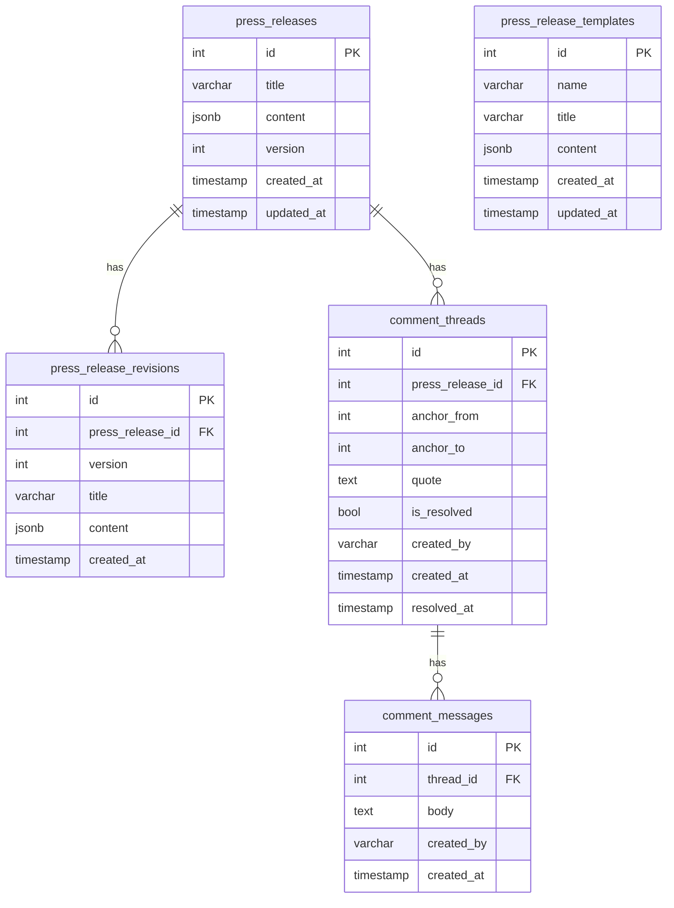
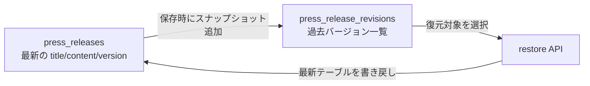
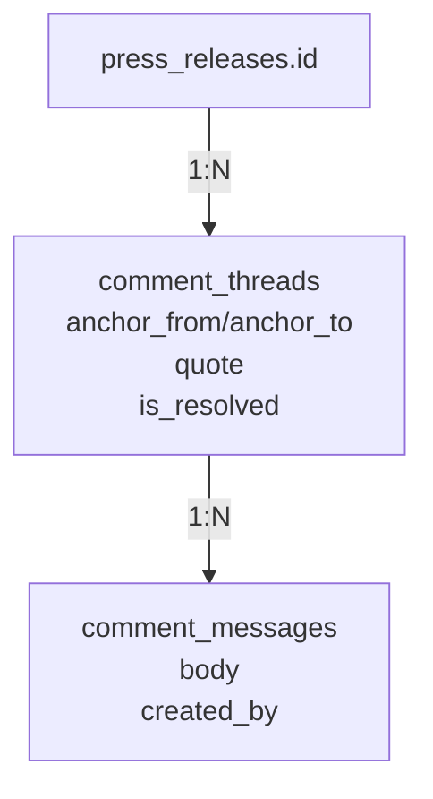
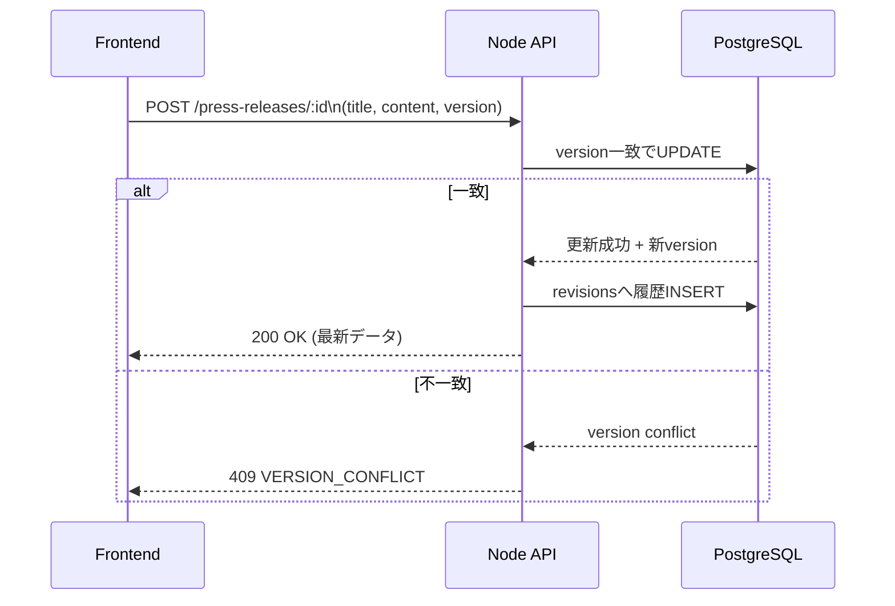
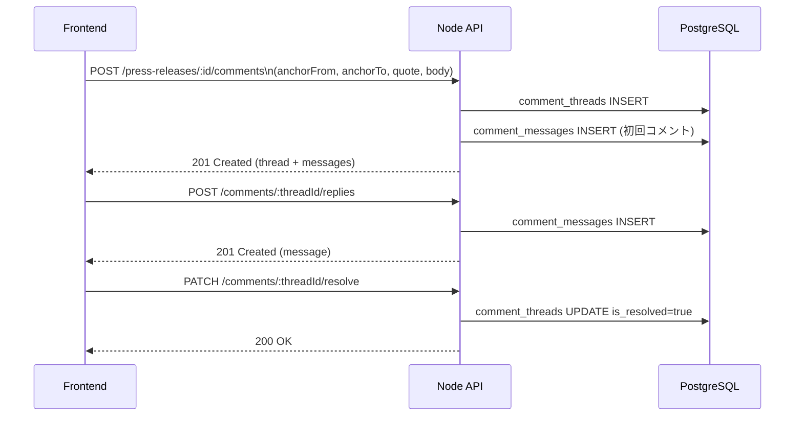

# PRTimes Editor DBスキーマ解説

このドキュメントは、現在のDB設計（PostgreSQL）をMermaid図で可視化しつつ、
テーブル間の関係と保存フローをまとめたものです。

## 1. 全体ER図

## 2. press_releases と press_release_revisions の関係

`press_releases` は「最新状態」を持つテーブル、`press_release_revisions` は「履歴スナップショット」を持つテーブルです。

- `press_releases` は1レコード1記事の現在値
- 保存（更新）ごとに `version` が進む
- 保存時にその時点の内容が `press_release_revisions` に追記される
- `press_release_revisions.press_release_id` で親記事を参照

### 図: 最新状態と履歴の住み分け

## 3. コメント系テーブルの関係

コメント機能は「スレッド」と「メッセージ」の2層です。

- `comment_threads`: 本文のどこに対するコメントか（アンカー）を保持
- `comment_messages`: スレッド内の会話（初回コメント + 返信）

### 図: コメント構造

## 4. 保存フロー（通常編集）

通常保存では、楽観ロック（version）を使って競合を防ぎます。

## 5. コメント保存フロー

## 6. 設計上のポイント

- `press_releases` と `press_release_revisions` を分離しているため、一覧取得は軽く、履歴も失わない
- `version` による競合検知で同時編集時の上書き事故を抑制
- コメントのアンカー情報（`anchor_from`, `anchor_to`）で本文上の位置と紐づけ可能
- コメント解決は物理削除ではなく `is_resolved` で論理的に非表示制御
- `resolved_at` を持つので、解決タイミングの監査にも対応しやすい

## 7. 補足: テンプレートテーブル

`press_release_templates` は記事本体とは独立した再利用コンテンツです。

- 記事本体のversion管理には関与しない
- 任意タイミングでエディタに適用するための雛形データを保持
