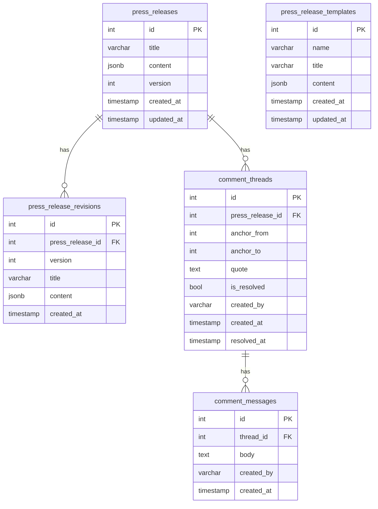
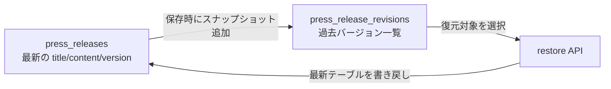
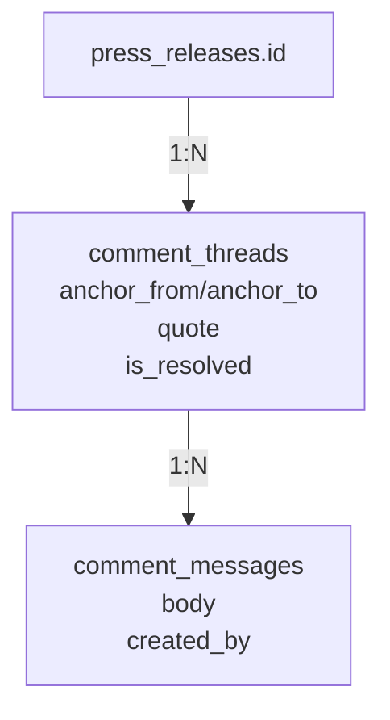

# PRTimes Editor DBスキーマ概要

このドキュメントは、現在の DB 設計（PostgreSQL）のテーブル構造と役割分担をまとめたものです。

## 1. 全体 ER 図

## 2. `press_releases` と `press_release_revisions`

`press_releases` は「最新状態」を持つテーブル、`press_release_revisions` は「履歴スナップショット」を持つテーブルです。

- `press_releases` は 1 レコード 1 記事の現在値
- 保存ごとに `version` が進む
- 保存時にその時点の内容が `press_release_revisions` に追記される
- `press_release_revisions.press_release_id` で親記事を参照する

### 図: 最新状態と履歴の住み分け

## 3. コメント系テーブル

コメント機能は「スレッド」と「メッセージ」の 2 層です。

- `comment_threads`: 本文のどこに対するコメントかを保持
- `comment_messages`: スレッド内の会話本体を保持

### 図: コメント構造

## 4. テンプレートテーブル

`press_release_templates` は記事本体とは独立した再利用コンテンツです。

- 記事本体の version 管理には関与しない
- 任意タイミングでエディタに適用するための雛形データを保持する

## 5. 設計上のポイント

- `press_releases` と `press_release_revisions` を分離しているため、一覧取得は軽く、履歴も失わない
- `version` による競合検知で同時編集時の上書き事故を抑制できる
- コメントのアンカー情報により本文上の位置と紐づけられる
- コメント解決は物理削除ではなく `is_resolved` による論理制御
- `resolved_at` を持つため、解決タイミングの監査もしやすい
