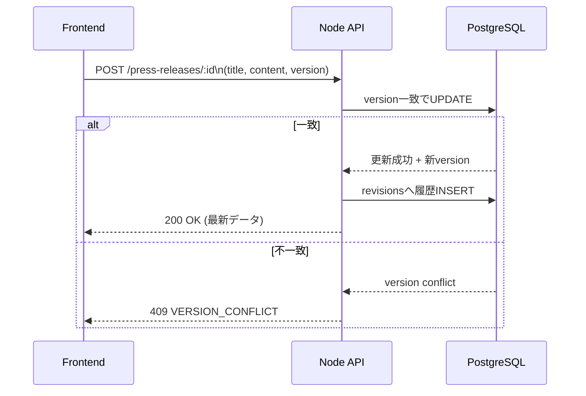
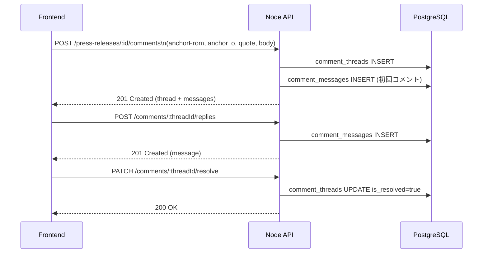

# PRTimes Editor 保存フローとコメントフロー

このドキュメントは、DB へどう保存されるかという観点で、通常編集とコメント操作の流れをまとめたものです。

## 1. 通常保存フロー

通常保存では、楽観ロックとして `version` を使って競合を防ぎます。

### 保存時のポイント

- `press_releases` には常に最新状態だけを保持する
- 更新成功時に `press_release_revisions` へ履歴を追加する
- `version` が一致しない場合は 409 を返して上書き事故を防ぐ

## 2. コメント保存フロー

コメントは、スレッド作成とメッセージ追加を分けて扱います。

### コメント時のポイント

- コメント作成時は、まず `comment_threads` を作る
- 初回コメント本文は `comment_messages` に入る
- 返信は `comment_messages` の追加だけで表現する
- 解決は削除ではなく `is_resolved=true` の更新で扱う

## 3. 関連ドキュメント

- テーブル構造は [DB スキーマ概要](./db-schema.md)
- AI agent 側の処理は [AI Agent アーキテクチャ概要](./agent-overview.md)
